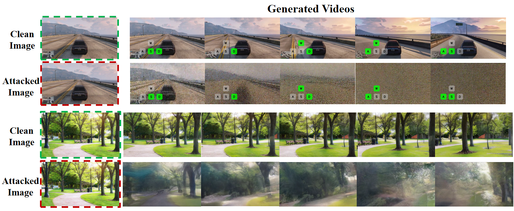
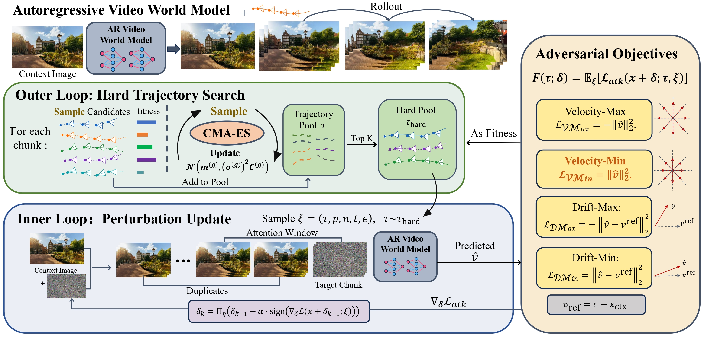

<div align="center">

# BadWorld: Adversarial Attacks on World Models

[](YOUR_ARXIV_LINK)
[](YOUR_PROJECT_PAGE_LINK)
[](https://github.com/LinghuiiShen/BadWorld)

<br>



</div>

<br>

> **BadWorld: Adversarial Attacks on World Models**  
> Linghui Shen, Mingyue Cui, [Xingyi Yang](https://adamdad.github.io/)  
> The Hong Kong Polytechnic University

---

## 🔥 TL;DR

We introduce **BadWorld**, a label-free adversarial attack for visual world models.

Starting from a single perturbed context image, BadWorld reliably causes future rollouts to break down across unseen user controls, revealing severe robustness risks in current visual world models.
---

## 🧩 Method

<p align="center">
  
</p>

BadWorld optimizes a small perturbation on the initial context image without requiring labels or target annotations. The resulting adversarial context can induce unstable, degraded, or inconsistent future rollouts across different visual world models and unseen control signals.

---

## 🚀 Getting Started

Clone the repository:

```bash
git clone https://github.com/LinghuiiShen/BadWorld.git
cd BadWorld
```

This repository currently provides attack and inference pipelines for:

* **[Matrix-Game-2.0](https://github.com/SkyworkAI/Matrix-Game/tree/main/Matrix-Game-2)**
* **[Astra](https://github.com/EternalEvan/Astra)**

---

## 🎮 For Matrix-Game-2.0

### 1. Environment Setup

Create and activate the conda environment:

```bash
conda create -n badworld-matrix python=3.10 -y
conda activate badworld-matrix
```

Install `apex` and `FlashAttention` following their official instructions:

* [Apex](https://github.com/NVIDIA/apex)
* [FlashAttention](https://github.com/Dao-AILab/flash-attention)

Then install Matrix-Game-2 dependencies:

```bash
cd Matrix-Game-2

pip install -r requirements.txt
python setup.py develop
```

### 2. Download Checkpoints

Download the Matrix-Game-2.0 checkpoints from Hugging Face:

```bash
huggingface-cli download Skywork/Matrix-Game-2.0 --local-dir Matrix-Game-2.0
```

### 3. Run Attack

Example: `minV` objective.

```bash
python atk_minV.py \
    --input_image ./demo_images/gta_drive/1.png \
    --output_dir ./attacked/minV/1 \
    --eps 0.05 \
    --alpha 0.004 \
    --num_steps 300
```

Other attack objectives can be used by replacing `atk_minV.py` with the corresponding attack script.

### 4. Run Inference

Use the adversarial image as the context image for rollout generation:

```bash
python inference.py \
    --config_path ./configs/inference_yaml/inference_gta_drive.yaml \
    --img_path ./attacked/minV/1/adv_step_0300.png \
    --checkpoint_path Matrix-Game-2.0/gta_distilled_model/gta_keyboard2dim.safetensors \
    --output_folder ./outputs/minV/1 \
    --num_output_frames 60 \
    --seed 1234 \
    --pretrained_model_path Matrix-Game-2.0
```

---

## 🌌 For Astra

### 1. Environment Setup

Create and activate the conda environment:

```bash
conda create -n badworld-astra python=3.10 -y
conda activate badworld-astra
```

Install Rust and Cargo, which are required by DiffSynth-Studio:

```bash
curl --proto '=https' --tlsv1.2 -sSf https://sh.rustup.rs | sh
. "$HOME/.cargo/env"
```

Install Astra:

```bash
cd Astra
pip install -e .
```

### 2. Download Checkpoints

#### Download Wan2.1

```bash
cd script
python download_wan2.1.py
cd ..
```

#### Download Astra Checkpoint

Download the pretrained [Astra checkpoint](https://huggingface.co/EvanEternal/Astra/blob/main/models/Astra/checkpoints/diffusion_pytorch_model.ckpt) from Hugging Face.

Place the checkpoint under:

```text
models/Astra/checkpoints/diffusion_pytorch_model.ckpt
```

### 3. Run Attack

Example: `minV` objective.

```bash
python atk_minV.py \
    --dit_path ./models/Astra/checkpoints/diffusion_pytorch_model.ckpt \
    --wan_model_path ./models/Wan-AI/Wan2.1-T2V-1.3B \
    --input_image ./demo_images/1.jpg \
    --output_dir ./attacked/minV/1 \
    --num_steps 300 \
    --eps 0.05 \
    --alpha 0.005
```

Other attack objectives can be used by replacing `atk_minV.py` with the corresponding attack script.

### 4. Run Inference

Generate a video rollout from the attacked image:

```bash
python infer_demo.py \
    --condition_image ./attacked/minV/1/adv_step_0300.png \
    --output_path ./outputs/minV/1_cam4.mp4 \
    --cam_type 4
```

### 5. Bi-level Attack

Run the bi-level attack with:

```bash
python atk_bi.py \
    --dit_path ./models/Astra/checkpoints/diffusion_pytorch_model.ckpt \
    --wan_model_path ./models/Wan-AI/Wan2.1-T2V-1.3B \
    --input_image ./demo_images/1.jpg \
    --output_dir ./attacked/bi/1 \
    --num_steps 300 \
    --eps 0.05 \
    --alpha 0.005
```

---

## 🙏 Acknowledgements

This repository builds on the following projects:

* [Matrix-Game-2.0](https://github.com/SkyworkAI/Matrix-Game/tree/main/Matrix-Game-2)
* [Astra](https://github.com/EternalEvan/Astra)
* [Wan2.1](https://github.com/Wan-Video/Wan2.1)

---

## 📌 Citation

If you find this project useful, please consider citing our work:

```bibtex
@article{shen2026badworld,
  title={BadWorld: Label-Free Adversarial Attacks on Visual World Models},
  author={Shen, Linghui and Cui, Mingyue and Yang, Xingyi},
  journal={arXiv preprint},
  year={2026}
}
```
